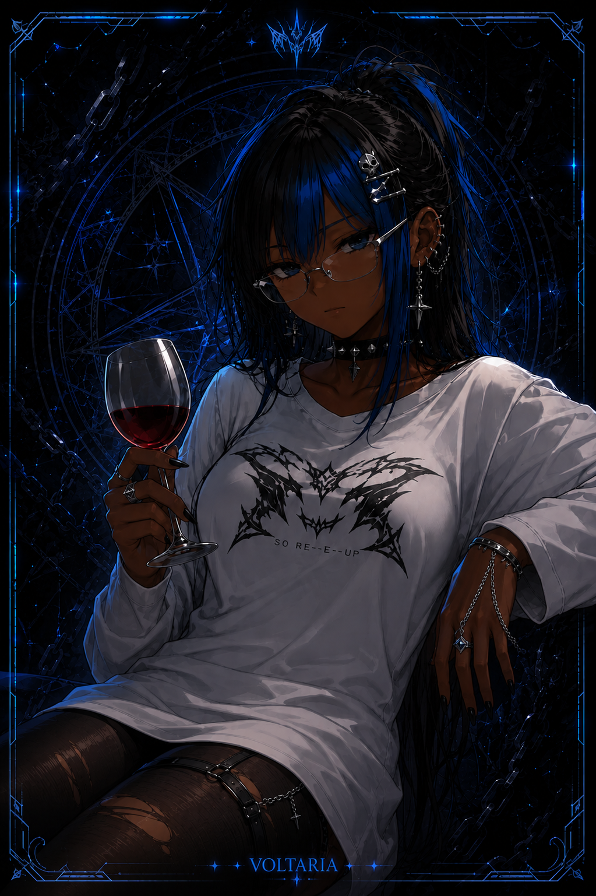

<p align="center">
  <a href="https://github.com/akiraxyd-005/Voltaria-v2.0">
    
  </a>
</p>

<h1 align="center">⚡ VOLTARIA NEXUS ⚡</h1>

<p align="center">
  <i>Inspired by <a href="https://github.com/FantoX/Atlas-MD">Atlas MD</a> — Built with Baileys Multi-Device</i>
</p>

<p align="center">
  <a href="https://github.com/akiraxyd-005/Voltaria-v2.0/fork">
    
  </a>
  &nbsp;
  <a href="https://github.com/akiraxyd-005/Voltaria-v2.0/stargazers">
    
  </a>
</p>

<p align="center">
  <a href="https://github.com/Arashi005">
    
  </a>
  <a href="https://github.com/akiraxyd-005">
    
  </a>
  
  <a href="https://github.com/akiraxyd-005/Voltaria-v2.0">
    
  </a>
  <a href="https://github.com/akiraxyd-005/Voltaria-v2.0">
    
  </a>
</p>

---

## ⚠️ Warning

- This bot is **not made by WhatsApp Inc.** — overuse may result in account ban.
- Support is provided **only for deployment/setup**, not for custom development.
- Made for **Educational / Fun / Group Management** purposes only. Arashi is not responsible for misuse.

---

## 🎀 Key Features at a Glance

| Category | Details |
|----------|---------|
| 💰 **Economy** | Currency, bank, cards, shop, leaderboard |
| 🎰 **Gambling** | Coinflip, Slots, Blackjack, Dice |
| 🎮 **Games** | Tic Tac Toe, Hangman, Trivia, Riddle, Wordle, Guess Song, Who Am I |
| 👥 **Group** | Welcome/Goodbye, antilink, warn/kick, tagall, polls |
| 🤖 **AI** | Gemini AI, GPT chat, image generation |
| 📥 **Download** | YouTube, TikTok, Instagram, Twitter, Spotify |
| 🎭 **Reactions** | Hug, kiss, pat, slap, dance (GIFs) |
| 🎵 **Audio** | Voice effects (deep, robot, nightcore, etc.) |
| 👑 **Owner** | Broadcast, restart, ban, sudo, mode |

---

## 🆘 Support

For **bot issues, deployment help, or setup questions**:

- **Direct WhatsApp:** [Contact Arashi](https://wa.me/254108720384)
- **Note:** Support is provided ONLY for deployment/setup issues, not custom development or feature requests.

---

## 🚀 One-Click Deploy

<p align="center">

| Platform    | Deploy |
| ----------- | ------ |
| **Railway** | <a href="https://railway.app/template/YOUR_TEMPLATE_ID_HERE"></a> |
| **Render**  | <a href="https://render.com/deploy"></a> |

</p>

---

## 🔧 Environment Variables

| Variable | Description | Required |
|----------|-------------|----------|
| OWNER_NUMBER | Your WhatsApp number (with country code) | ✅ |
| BOT_NAME | Bot display name | ✅ |
| PREFIX | Command prefix (default: §) | ✅ |
| SESSION_ID | Session ID for auto-login | Optional |

---

## 📦 Local Installation

**Requirements:** Node.js · Git

```bash
# 1. Clone and enter the directory
git clone https://github.com/akiraxyd-005/Voltaria-v2.0
cd Voltaria-v2.0

# 2. Install dependencies
npm install

# 3. Start the bot
npm start
```

Scan the QR that appears in your terminal via WhatsApp → Settings → Linked Devices → Link a device.

Lost your session? Delete the session folder and restart.

---

📝 Type §menu in WhatsApp to see all commands

---

👥 Credits

· Inspired by: <a href="https://github.com/FantoX/Atlas-MD">Atlas MD</a> by <a href="https://github.com/FantoX">FantoX</a> & Team Atlas
· Built with: <a href="https://github.com/WhiskeySockets/Baileys">Baileys</a>

Developer: <a href="https://github.com/Arashi005">Arashi</a> (@Arashi005)

Contributor: <a href="https://github.com/akiraxyd-005">akiraxyd</a> (@akiraxyd-005)

---

📛 Legal Disclaimer

· Use your own configuration for privacy and security.
· Heavy modifications are at your own risk — we cannot support every custom fork.
· We are not responsible for harm caused by individuals running this bot in groups.

---

📜 License

MIT License

---

⭐ Don't forget to star this repository ⭐

---

<p align="center">
  <b>© POWERED BY N£XUS</b>
</p>